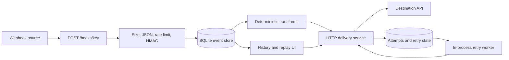

# HookRelay

> Receive, inspect, transform and replay webhooks without the plumbing.

[](https://github.com/andyst-dev/hookrelay/actions/workflows/ci.yml)

HookRelay is a compact webhook gateway for development and small-team workflows. It accepts JSON events at stable public URLs, verifies optional HMAC signatures, applies a deliberately small set of deterministic transformations, forwards payloads, records every attempt, retries failures, and lets operators replay old events.

It exists for the space between “log the request body” and a distributed event platform: integration work where inspectability matters but operating a queue cluster does not.

## Features

- Endpoint management through a typed REST API and server-rendered UI
- Raw-body HMAC SHA-256 verification with constant-time comparison
- Rename, remove, add, copy and wrap JSON transformations
- HTTP forwarding with bounded timeouts and response capture
- Persisted exponential retry state and manual replay
- Event filters, request/response evidence and attempt history
- Header redaction, payload limits, per-endpoint rate limits and SSRF checks
- A safe built-in demo receiver that requires no external service
- SQLite by default, Docker packaging, Render blueprint and GitHub Actions CI

## Architecture



FastAPI owns HTTP and lifecycle concerns. SQLAlchemy persists three domain models: `Endpoint`, `Event`, and `DeliveryAttempt`. Immediate delivery uses a FastAPI background task; a single application task polls persisted due retries. Jinja templates and a small vanilla JavaScript file provide the UI.

## Transformations

Rules run in order and never execute user code. Dot-separated paths address nested objects.

```json
[
  {"op": "rename", "from": "type", "to": "event_type"},
  {"op": "copy", "from": "customer.email", "to": "email"},
  {"op": "remove", "path": "customer"},
  {"op": "add", "path": "source", "value": "hookrelay-demo"}
]
```

The demo input becomes:

```json
{
  "amount": 4900,
  "currency": "CHF",
  "email": "demo@example.com",
  "event_type": "payment.completed",
  "id": "evt_demo_001",
  "source": "hookrelay-demo"
}
```

`wrap` accepts a `root` property. Missing paths and paths that cross scalar values fail explicitly.

## Signed webhooks

For endpoints with a signing secret, HookRelay expects:

```text
X-HookRelay-Signature: sha256=<hex digest>
```

The digest is `HMAC-SHA256(secret, raw_request_body)`. Invalid signatures are recorded as rejected events and are never forwarded.

```python
import hashlib, hmac, json, httpx

body = json.dumps({"type": "payment.completed"}, separators=(",", ":")).encode()
signature = hmac.new(b"replace-with-a-long-secret", body, hashlib.sha256).hexdigest()
httpx.post(
    "http://localhost:8000/hooks/YOUR_KEY",
    content=body,
    headers={"Content-Type": "application/json", "X-HookRelay-Signature": f"sha256={signature}"},
)
```

Signing secrets are never returned by the API or rendered in the UI. V1 stores them in the application database without field-level encryption; protect the database file and use a dedicated secret.

## Delivery, retries and replay

Any 2xx response succeeds. Network errors and non-2xx responses are recorded with duration, status and a bounded response excerpt. Defaults schedule three retries after 10 seconds, 30 seconds and 2 minutes. State is persisted, so due events continue after an ordinary restart.

Replay preserves the original payload, reapplies the endpoint’s **current** transformation rules, resets the retry sequence and records a delivery attempt marked `manual replay`:

```bash
curl -X POST http://localhost:8000/api/events/42/replay
```

## API

Interactive OpenAPI documentation is at `/docs`.

| Method | Path | Purpose |
| --- | --- | --- |
| `GET` | `/api/health` | Versioned health check |
| `GET`, `POST` | `/api/endpoints` | List or create endpoints |
| `GET`, `PATCH`, `DELETE` | `/api/endpoints/{id}` | Inspect or manage an endpoint |
| `GET` | `/api/events` | Filter event history |
| `GET` | `/api/events/{id}` | Inspect an event and attempts |
| `POST` | `/api/events/{id}/replay` | Replay an event |
| `POST` | `/hooks/{endpoint_key}` | Receive a JSON webhook |

Create an endpoint:

```bash
curl -X POST http://localhost:8000/api/endpoints \
  -H 'Content-Type: application/json' \
  -d '{"name":"Local receiver","destination_url":"http://localhost:9000/incoming","transformation_rules":[]}'
```

Local destinations require the explicit development setting described below.

## Local development

Python 3.12 or newer is required.

```bash
python -m venv .venv
source .venv/bin/activate
pip install -e '.[dev]'
cp .env.example .env
uvicorn app.main:app --reload
```

Open <http://localhost:8000>. The deterministic demo works immediately.

For real local forwarding, set `ALLOW_PRIVATE_DESTINATIONS_FOR_DEV=true`, then run:

```bash
python scripts/mock_receiver.py --port 9000 --status 200
python scripts/send_demo_webhook.py --url http://localhost:8000/hooks/demo
```

Create a non-demo endpoint targeting `http://localhost:9000/incoming` to exercise the mock receiver. The mock can return failures with `--status 503`.

## Docker

```bash
docker build -t hookrelay .
docker run --rm -p 8000:8000 -v hookrelay-data:/app/data hookrelay
curl http://localhost:8000/api/health
```

The image runs as an unprivileged user and includes an HTTP health check.

## Testing

```bash
ruff check .
ruff format --check .
pytest
```

CI applies the same checks, enforces 90% branch coverage and builds the Docker image.

## Security model

HookRelay assumes its management API and UI are deployed on a trusted network unless `PUBLIC_DEMO_MODE=true`. V1 intentionally has no authentication. Do not expose management routes publicly with editing enabled.

- Destination URLs accept only HTTP(S), reject embedded credentials, fragments, localhost, private, link-local, multicast, reserved and cloud-metadata addresses by default, and resolve hostnames before delivery.
- Redirects are disabled. The address is checked again immediately before each attempt.
- DNS rebinding cannot be eliminated completely without connecting to the validated IP and preserving TLS hostname verification. Treat the current checks as defense in depth, not a sandbox for hostile tenants.
- `ALLOW_PRIVATE_DESTINATIONS_FOR_DEV=true` disables private-address rejection and must only be used locally.
- Authorization, cookie, API-key and token headers are discarded; useful stored header values and response bodies are truncated.
- Raw request size, stored response size, retry count and request rate are bounded.
- Jinja autoescaping remains enabled, debug mode is off, and no permissive CORS middleware is installed.

## Configuration

| Variable | Default | Meaning |
| --- | --- | --- |
| `DATABASE_URL` | `sqlite:///./data/hookrelay.db` | SQLAlchemy database URL |
| `BASE_URL` | `http://localhost:8000` | Public URL used in generated examples |
| `RENDER_EXTERNAL_HOSTNAME` | unset | Render-provided hostname; overrides `BASE_URL` with HTTPS |
| `MAX_PAYLOAD_SIZE_MB` | `1` | Maximum incoming JSON body |
| `MAX_RESPONSE_CAPTURE_BYTES` | `4096` | Stored destination response excerpt |
| `MAX_RETRIES` | `3` | Automated attempts after the initial delivery |
| `EVENT_RETENTION_HOURS` | `168` | Reserved retention horizon; automatic pruning is not in V1 |
| `RATE_LIMIT_PER_MINUTE` | `60` | Per-process, per-endpoint receive limit |
| `ALLOW_PRIVATE_DESTINATIONS_FOR_DEV` | `false` | Allow local/private destinations for development |
| `PUBLIC_DEMO_MODE` | `false` | Disable endpoint configuration mutations |

## Project structure

```text
app/
  api.py             REST and webhook routes
  main.py            application lifecycle and UI routes
  models.py          SQLAlchemy domain models
  services.py        shared endpoint/replay operations, delivery, retries and demo seed
  security.py        HMAC, header filtering and SSRF checks
  transformations.py deterministic JSON rule engine
  templates/ static/ server-rendered interface
scripts/             mock receiver and demo sender
tests/               API, security, delivery and UI flows
```

## Limitations

- The retry worker and rate limiter are single-process. Multiple app replicas can duplicate retries and do not share rate limits.
- SQLite is suitable for the demo and light workloads, not a high-throughput queue.
- Endpoint secrets are not encrypted at rest.
- Event retention is configurable metadata but V1 does not run automatic pruning.
- There is no authentication, team model or per-user isolation.
- SSRF protection is deliberately conservative but cannot guarantee safety against every DNS-level attack.

## License

[MIT](LICENSE)
